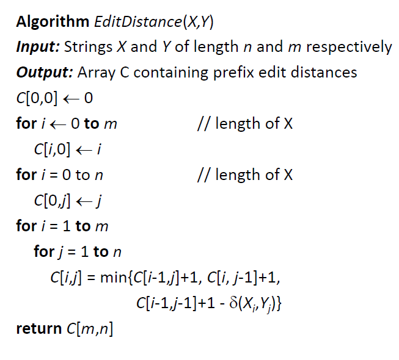

# 72. Edit Distance
Given two words word1 and word2, find the minimum number of operations required to convert word1 to word2.

You have the following 3 operations permitted on a word:

Insert a character
Delete a character
Replace a character
Example 1:
```
Input: word1 = "horse", word2 = "ros"
Output: 3
Explanation: 
horse -> rorse (replace 'h' with 'r')
rorse -> rose (remove 'r')
rose -> ros (remove 'e')
```
Example 2:
```
Input: word1 = "intention", word2 = "execution"
Output: 5
Explanation: 
intention -> inention (remove 't')
inention -> enention (replace 'i' with 'e')
enention -> exention (replace 'n' with 'x')
exention -> exection (replace 'n' with 'c')
exection -> execution (insert 'u')
```

## Solution




``` java
class Solution {
    public int minDistance(String word1, String word2) {
        int m = word1.length();
        int n = word2.length();
        int[][] mat = new int[m+1][n+1];
        for(int i = 0; i < m+1; i++)
            mat[i][0] = i;
        for(int j = 0; j < n+1; j++)
            mat[0][j] = j;
        
        for(int i = 1; i < m+1; i++)
            for(int j = 1; j < n+1; j++)
                mat[i][j] = min(mat[i-1][j]+1, mat[i][j-1]+1, word1.charAt(i-1) == word2.charAt(j-1) ? mat[i-1][j-1] : mat[i-1][j-1] + 1);
            
        return mat[m][n];
    }
    
    public int min(int a, int b, int c){
        int tmp = a > b ? b : a;
        return tmp > c ? c : tmp;
    }
}
```