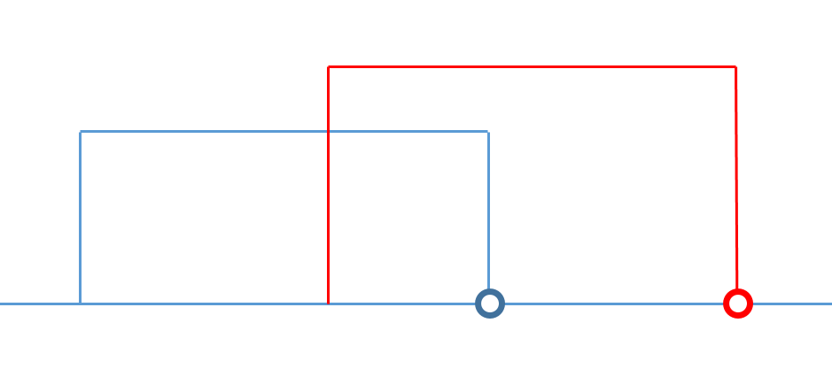
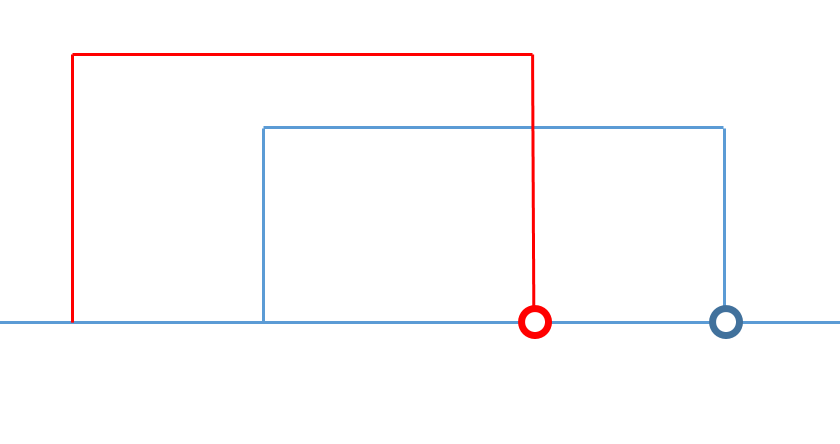
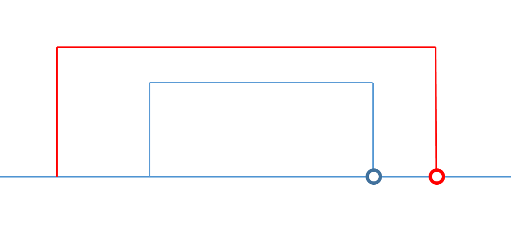
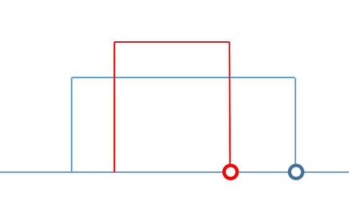

# 729. My Calendar I

Implement a MyCalendar class to store your events. A new event can be added if adding the event will not cause a double booking.

Your class will have the method, book(int start, int end). Formally, this represents a booking on the half open interval [start, end), the range of real numbers x such that start <= x < end.

A double booking happens when two events have some non-empty intersection (ie., there is some time that is common to both events.)

For each call to the method MyCalendar.book, return true if the event can be added to the calendar successfully without causing a double booking. Otherwise, return false and do not add the event to the calendar.

Your class will be called like this: MyCalendar cal = new MyCalendar(); MyCalendar.book(start, end)
Example 1:
```
MyCalendar();
MyCalendar.book(10, 20); // returns true
MyCalendar.book(15, 25); // returns false
MyCalendar.book(20, 30); // returns true
Explanation: 
The first event can be booked.  The second can't because time 15 is already booked by another event.
The third event can be booked, as the first event takes every time less than 20, but not including 20.
```
Note:

The number of calls to MyCalendar.book per test case will be at most 1000.
In calls to MyCalendar.book(start, end), start and end are integers in the range [0, 10^9].

## Solution 
在四种情况下会出现double booking的情况:   
<font color="red">***红色为新加入的interval***</font>  






1. 
使用linkedList存储interval,不需要按照顺序存储,每次插入时需要遍历所有的list
``` java
class MyCalendar {

    class Node{
        int start;
        int end;
        Node next;
        public Node(int start, int end){
            this(start,end,null);
        }
        public Node(int start, int end, Node next){
            this.start = start;
            this.end = end;
            this.next = next;
        }
    }
    
    Node head;
    public MyCalendar() {
    }
    
    public boolean book(int start, int end) {
        if(start > end)
            return false;
        if(head == null){
            head = new Node(start, end);
            return true;
        } else{
            Node n = this.head;
            while(n != null){
                if((n.start <= start && n.end > start) || (n.start < end && n.end >= end) ||(n.start <= start && n.end >= end) || (n.start >= start && n.end <= end))
                    return false;
                n = n.next;
            }
            n = new Node(start,end,head);
            this.head = n;
            return true;
        }
        
    }
}

/**
 * Your MyCalendar object will be instantiated and called as such:
 * MyCalendar obj = new MyCalendar();
 * boolean param_1 = obj.book(start,end);
 */
 ```

 2. 
 用ArrayList按照顺序存储intervals
 ``` java
 class MyCalendar {

    class Node{
        int start;
        int end;
        public Node(int start, int end){
            this.start = start;
            this.end = end;
        }
    }
    
    List<Node> list;
    public MyCalendar() {
         list = new ArrayList<>();
    }
    
    public boolean book(int start, int end) {
        int i = 0;
        
        while(i < list.size() && list.get(i).end <= start)
            i++;
        //这里找到的i满足两个条件,list.get(i).end > start 并且 list.get(i-1).end <= start
        //那么只要满足end <= list.get(i).start就说明可以被插入而不会出现double-booking
        if(i == list.size() || (i < list.size() && end <= list.get(i).start)){
            list.add(i,new Node(start,end));
            return true;
        }
        return false;
            
        
    }
}

/**
 * Your MyCalendar object will be instantiated and called as such:
 * MyCalendar obj = new MyCalendar();
 * boolean param_1 = obj.book(start,end);
 */
 ```